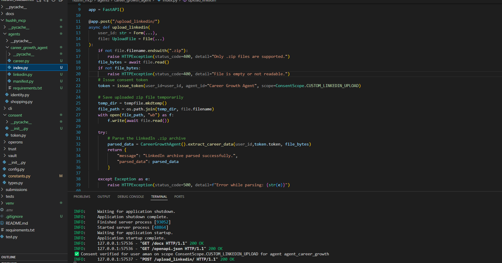
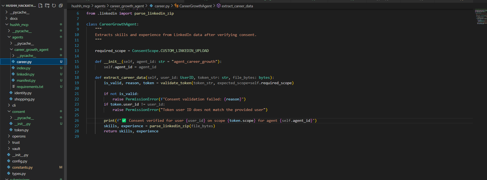

This is the index file where logic of the agent has been written and will be written. 
First thing is that the users uploads there linkedin archieve so that our agent can parse/retrive useful information. 

But first if validates the tokens which is present in career.py, this is just initial work

